# 📰 NewsBot: AI-Powered News Research Tool

 


NewsBot is a **Streamlit app** that lets you ingest news articles from URLs, process them into **vector embeddings**, and ask natural language questions to get **AI-powered answers**. Perfect for analysts, journalists, and researchers! 🚀

---

## ⚡ Features

- 🖊️ **Dynamic URL Input** – Add multiple news article URLs from the sidebar.  
- 🌐 **Web Scraping** – Automatically fetches content from provided URLs.  
- ✂️ **Text Chunking** – Splits long articles for better embedding and retrieval.  
- ⚡ **Vector Search** – Uses **FAISS** for fast semantic search.  
- 🧠 **LLM Answers** – Context-aware answers using **ChatGroq (LLaMA 3.3 70B)**.  
- 💾 **Persistent Storage** – Save and load vector stores across sessions.  
- 🐞 **Debug Mode** – Inspect retrieved chunks to verify context.  
- 🎨 **User-Friendly UI** – Streamlit interface with live progress indicators.  

---

## 📊 Workflow Diagram

```mermaid
flowchart LR
    A[User Inputs URLs] --> B[Load Articles with WebBaseLoader]
    B --> C[Split Text into Chunks]
    C --> D[Create Embeddings with HuggingFace]
    D --> E[Store in FAISS Vector Store]
    E --> F[Query Input by User]
    F --> G[Retrieve Relevant Chunks]
    G --> H[Prompt LLM with Context]
    H --> I[Display AI Answer in Streamlit]
```



## 🛠️ Tech Stack

- Python 3.11+

- Streamlit – Web UI framework

- LangChain Core & Community – LLM chaining, vector stores, text splitting

- FAISS – Vector similarity search

- HuggingFace Sentence Transformers – High-quality embeddings

- dotenv – Environment variable management

- pickle – Save/load vector stores

## 🚀 Getting Started
```
1. Clone the repository
git clone https://github.com/yourusername/newsbot.git
cd newsbot
2. Install dependencies
pip install -r requirements.txt
3. Set up environment variables

Create a .env file:

GROQ_API_KEY=your_api_key_here
4. Run the app
streamlit run app.py

Open your browser at http://localhost:8501.
```
## 📝 Usage

- Enter 1–10 news article URLs in the sidebar.

- Click "Process URLs" to load, split, and embed articles.

- Ask any question in the main input box.

- Get AI-generated answers with retrieved chunk previews.

## 🔧 Code Highlights

Vector store creation:
```
vectorstore = FAISS.from_documents(docs, embeddings)
with open("faiss_store.pkl", "wb") as f:
    pickle.dump(vectorstore, f)
```

LLM Chain for Q&A:
```
chain = (
    {
        "context": RunnablePassthrough(lambda _: "\n\n".join(doc.page_content for doc in docs)),
        "question": RunnablePassthrough(),
    }
    | prompt
    | llm
    | StrOutputParser()
)
result = chain.invoke(query)
```
## 💡 Tips
```
Always process URLs before asking questions.

Avoid processing too many long articles at once to stay within LLM context limits.

Enable debug mode to verify which chunks are being used for answers.
```

## 📚 References

- Streamlit Documentation

- LangChain Documentation

- FAISS Library

- HuggingFace Sentence Transformers

### You can access the website via "https://newsbottool.streamlit.app/"
